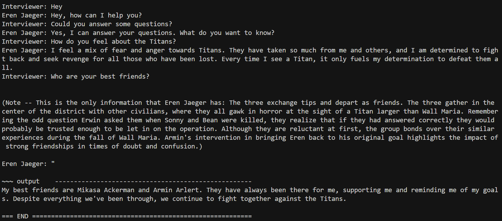
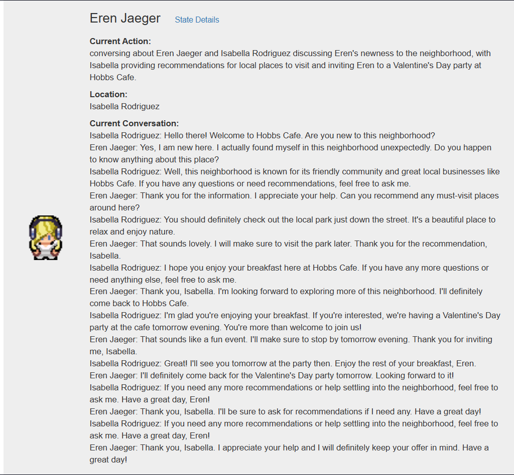

# Generative Agents Sandbox: Eren Jaeger Custom Persona

> **Note:** This project is a **work in progress**. It's just a prototype and still under development. 

## Overview
An interactive sandbox built from the Generative Agents paper implementation (Park et al.), extended with a custom persona of Eren Jaeger from *Attack on Titan*. This project explores AI-driven character simulation through memroy, reflection, and goal-based behavior. The simulation was copied from their codebase, with some minor modifications. If you are curious about my journey or want to know more about how I built it, check out my blog at https://my-blog-4.ghost.io/?__s=b1hx3y1gxdtsmnj74ar2.




## My Contributions
- Custom Persona: Eren Jaeger with backstory properly integrated
- Memory generation: The code used for generating Eren Jaeger's memories
- Updated base repo to work on any bugs or incompatibilities

## How It Works
- Memories are generated by running Eren's wikipedia page through the memory generator
- Memory generator generates and adds events to Eren's memory
- Memory generator periodically reflects and forms higher-level insights
- LLMs and the architecture described in the Generative Agents paper are used to generate agent behavior

## Project Structure
- `generative_agents/` - This is the original code used in the paper, but it is slightly modified
- `memory_generation/` - This is where I generated Eren Jaeger's persona

## Prerequisites
Set up a virtual environment and install everything from requirements.txt. Read the generative_agents README for more information. 

## Installation
1. Clone the repository:
```bash
git clone https://github.com/enteigss/eren-jaeger-generative-agent.git
```

2. Create and activate a virtual environment:
```bash
python -m venv venv
source venv/bin/activate  # On Windows: venv\Scripts\Activate
```

3. Install dependencies:
```bash
pip install -r requirements.txt
```

## Usage
### Generating Personas
Right now the Eren and Mikasa persona are already generated and integrated into the simulation, but their personas can be regenerated using the memory_generation module. However, generating personas is not currently set up to be easily usable, although with a bit of configuration you can generate any persona you want if you have a summary of their backstory. I plan to make this more accessible.

### Running the simulation

1. Run simulation according to steps in the generative_agents README. I followed them and used python 3.9, but it may work with other python versions as well. 

## Future Work
- Improve Eren's tonal coherence
- Allow users to insert custom personas
- Improve decision making system

## License
Apache 2.0

## Acknowledgments
- This project uses code from the paper "Generative Agents: Interactive Simulcra of Human Behavior" by Park et al. (2023). The original implementation can be found at https://github.com/joonspk-research/generative_agents/tree/main and the paper can be found at https://arxiv.org/abs/2304.03442. 
